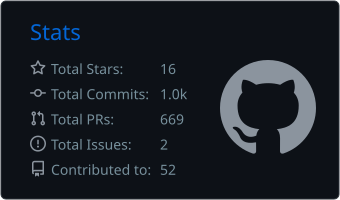

Hello there 👋,

i write ansible roles for fun!

You can get an overview [here](https://mullholland.net/ansible) or in my [github repositories](https://github.com/mullholland?tab=repositories&q=ansible-role&type=&language=&sort=).

- 🌐  Visit my [site](https://mullholland.net) for complete overview of my ansible and molecule workflow.
- 🗄 You can also take a look at my other snippets there.

  
  

